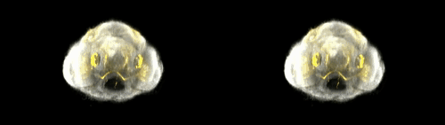

# Volume Renderer <small>for use with MATLAB®</small>

_Volume Renderer <small>for use with MATLAB®</small>_ extends MATLAB® by a GPU-accelerated volume render command that handles 3D volumetric data. The core application is implemented in C/C++. To guarantee fast computations the render process computes on the GPU. This is realized by NVIDIA® CUDA®. Furthermore _Volume Renderer <small>for use with MATLAB®</small>_ provides the following features:

*   **Special memory management:** Due to restricted GPU memory and the requirement to render more than one volume in one scene, we developed a special memory management to enable the rendering of huge data sets in separate rendering passes. Afterward these separately rendered images are combined to one image using MATLAB®.
*   **Generic illumination model:** We developed a generic illumination model that is easy to extend with other illumination functions. The provided function is the Henyey-Greenstein phase function.
*   **Stereo rendering:** In some use cases there is a nice feature to work with stereo images. Thus, the renderer offers the possibility to render off-axis stereo images.
*   **High usability:** To enable a high usability a MATLAB® interface consisting of several MATLAB® classes has been developed. Due to this interface it is uncomplicated to generate movies.
*   **Memory Management:** In order to increase the speed of the renderer, volumes are transferred to the GPU if any change of data occured. This is realized by persisting the memory between all render built upon [this code](https://de.mathworks.com/matlabcentral/fileexchange/38964-example-matlab-class-wrapper-for-a-c-class).

## Requirements
* CUDA® capable NVIDIA® graphics device with at least [Kepler™](https://en.wikipedia.org/wiki/Kepler_(microarchitecture)) architecture
* Linux or Windows computer (64 bit) with installed NVIDIA® driver and CUDA® 11
* MATLAB® [1](#f1) with
  * [Image Processing Toolbox](https://www.mathworks.com/products/image.html)
  * [Parallel Computing Tookbox](https://mathworks.com/products/parallel-computing.html) for compilation (requires [mexcuda](https://de.mathworks.com/help/parallel-computing/mexcuda.html))

## Installation
First download and extract or clone the repository. Next, download and install the following tools:
- [CUDA 11](https://developer.nvidia.com/cuda-downloads)
- [Setup some C compiler](https://de.mathworks.com/support/requirements/supported-compilers.html)

Next, open matlab and navigate to the folder with the render code in matlab. Adjust the CUDA path in `src/make.m` and run it from within `src`. This command will compile all mex-files for the renderer.
Either, enter `src/matlab` to run code and place your matlab renderer code there, or setup matlab to load this folder at each startup into its search path as described [here](https://de.mathworks.com/help/matlab/matlab_env/add-folders-to-matlab-search-path-at-startup.html) (recommended).

## Documentation
In order to generate a [doxygen documentation](https://doxygen.nl) in html, we offer a `Doxyfile`. Install the tool and run `doxygen Doxyfile`.
The resulting Documentation will be stored in `docs/doxygen`.

## Example
The following video demonstrates the power of the renderer[2](#f2):

### Example Code
In `src/matlab` are four examples:
  - `example1.m`: creating a 2D image of a zebrafish embrio dataset
  - `example1_grad.m`: same as above, but using precomputed gradient volumes instead of on the fly gradient computation
  - `example2.m`: create a video of the zebrafish embrio
  - `example3.m`: same as example 2, but using two channels

They all are built upon one dataset from [1]. In order to run the examples mentioned above, one needs to create the dir `h5-data/` and put `ViBE-Z_72hpf_v1.h5` into it. The scripts are setup to be run from within `src/`.

## License
- This work is licensed under [GNU Affero General Public License version 3](https://opensource.org/licenses/AGPL-3.0). 
- Copyright 2020-present © [Raphael Scheible](https://raphiniert.com)

## Acknowledgments
_Volume Renderer for use with MATLAB®_ was originally developed as a student project by Raphael Scheible at University of Freiburg supervised by [Benjamin Ummenhofer](http://lmb.informatik.uni-freiburg.de/people/ummenhof/) and [apl. Prof. Dr. Olaf Ronneberger](http://lmb.informatik.uni-freiburg.de/people/ronneber/).

## References
[1]  Ronneberger, O and Liu, K and Rath, M and Ruess, D and Mueller, T and Skibbe, H and Drayer, B and Schmidt, T and Filippi, A and Nitschke, R and Brox, T and Burkhardt, H and Driever, W. **[ViBE-Z: A Framework for 3D Virtual Colocalization Analysis in Zebrafish Larval Brains](http://lmb.informatik.uni-freiburg.de//Publications/2012/RLSDSBB12) .** 2012. _Nature Methods,_ 9(7):735--742. [↩](#r1)

---

1: tested and developed under R2022a; might work from R2018a [↩](#a1)  
2: provided by Benjamin Ummenhofer, data from <a id="r1">[[1]](#ref1)</a> [↩](#a2)
